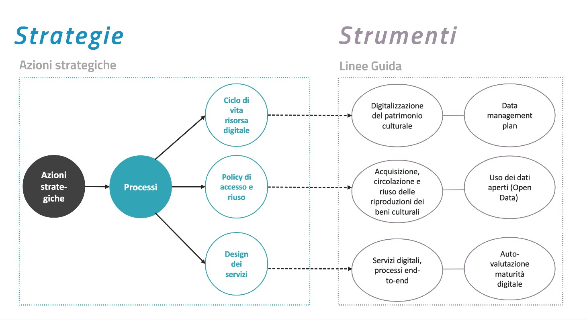

3. Linee guida per i processi di digitalizzazione
=================================================

Questa sezione del PND intende mettere a disposizione alcuni strumenti
per la pianificazione e l’esecuzione delle attività connesse alla
digitalizzazione del patrimonio culturale e dei servizi connessi. La
sezione si articola in una serie di allegati tecnici, ciascuno dei quali
approfondisce uno specifico aspetto delle pratiche di digitalizzazione.
Questi documenti, strutturati in forma di linee guida, saranno
sottoposti a periodiche verifiche per garantirne l’aggiornamento
rispetto all’evoluzione delle normative, dei metodi, degli standard e
dei progressi tecnologici.

Le linee guida definiscono approcci e procedure e forniscono riferimenti
informativi e non prescrittivi, illustrando i principali riferimenti
metodologici e tecnici, con il relativo corredo bibliografico. I
documenti si rivolgono al personale che negli istituti culturali è
coinvolto nei processi di trasformazione digitale, cui viene fornito un
quadro operativo multilivello, che può essere d’ausilio sia nelle
pratiche decisionali e strategiche, sia nella pianificazione e
nell’esecuzione delle operazioni.

Esiste una specifica correlazione fra le azioni strategiche e gli
strumenti a corredo del PND. Gli allegati tecnici offrono modelli e
suggeriscono procedure utili per affrontare le sfide organizzative e
metodologiche poste dall’attuazione dei processi individuati nella
sezione *Strategie*. Nello schema seguente (Figura 5) sono evidenziate
le relazioni fra i processi individuati dal PND e le corrispondenti
linee guida:

   del PND
   :width: 6.25in
   :height: 3.46872in

   Figura 5. Relazione fra le azioni strategiche e le linee guida del
   PND

.. _section-3:

.. toctree::
  :maxdepth: 3
  :caption: Indice dei contenuti

  linee-guida-per-i-processi-di-digitalizzazione/linee-guida-per-la-digitalizzazione-del-patrimonio-culturale.rst
  linee-guida-per-i-processi-di-digitalizzazione/linee-guida-per-la-redazione-del-piano-di-gestione-dei-dati.rst
  linee-guida-per-i-processi-di-digitalizzazione/linee-guida-per-lacquisizione-la-circolazione-e-il-riuso-delle-riproduzioni-dei-beni-culturali-in-ambiente-digitale.rst
  linee-guida-per-i-processi-di-digitalizzazione/linee-guida-per-la-classificazione-di-prodotti-e-servizi-digitali-processi-e-modelli-di-gestione.rst
  linee-guida-per-i-processi-di-digitalizzazione/introduzione-alla-metodologia-per-la-valutazione-della-maturità-digitale-degli-istituti-culturali.rst
