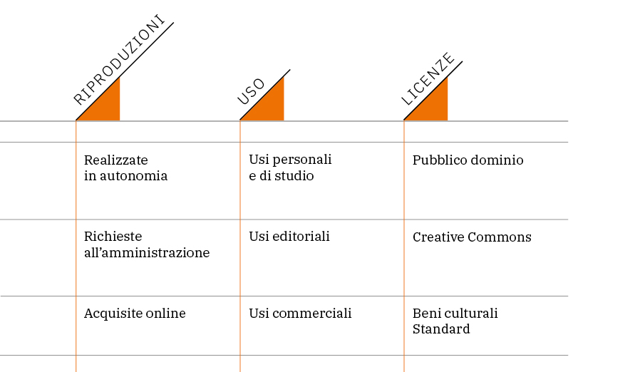

.. _linee_guida_acquisizione_circolazione_riuso:

Linee guida per l’acquisizione, la circolazione e il riuso delle riproduzioni dei beni culturali in ambiente digitale
======================================================================================================================

Le Linee guida 3 chiariscono le norme che disciplinano l’acquisizione,
la circolazione e il riuso delle riproduzioni dei beni culturali in
ambiente digitale, qui intesi nella loro accezione più ampia. Il
documento inquadra il contesto normativo di riferimento, fornendo
strumenti operativi (come diagrammi di flusso e tavole sinottiche) che
permettono di individuare gli ambiti legislativi corretti, in funzione
delle tipologie di bene culturale e delle modalità di riproduzione e
acquisizione di immagini e materiali audiovisivi, in relazione alle
diverse finalità di utilizzo e ai diritti d’autore eventualmente
gravanti sui beni e sulle riproduzioni. L’obiettivo dell’allegato è
mettere le istituzioni e gli utenti nelle condizioni di distinguere
senza equivoci i limiti e le possibilità di riutilizzo delle
riproduzioni rese disponibili in rete dagli istituti.

|image0|

*Figura 14. Sintesi degli ambiti trattati nell’allegato 3*

.. _Linee guida per l’acquisizione, la circolazione e il riuso delle riproduzioni dei beni culturali in ambiente digitale: https://docs.italia.it/italia/icdp/icdp-pnd-circolazione-riuso-docs/

.. admonition:: Allegato 3

  `Linee guida per l’acquisizione, la circolazione e il riuso delle riproduzioni dei beni culturali in ambiente digitale`_
