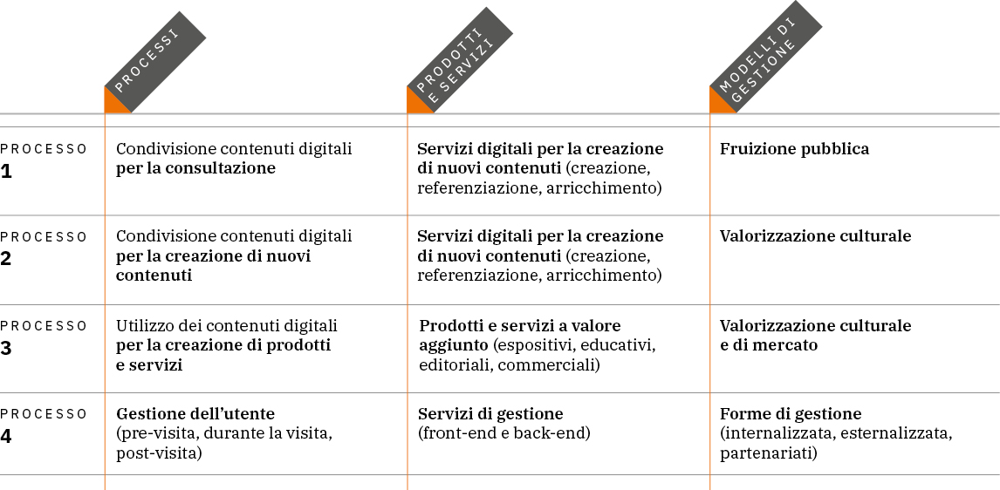

.. _linee_guida_classificazione:

Linee guida per la classificazione di prodotti e servizi digitali, processi e modelli di gestione
==================================================================================================

Partendo dalle diverse tipologie dei beni culturali e dal loro
potenziale di valorizzazione, le Linee guida 4 individuano e descrivono
le diverse tassonomie e mappature di processi e servizi menzionate nel
Piano nazionale di digitalizzazione del patrimonio culturale (PND), al
fine di ordinare i differenti concetti per tipologie “di senso” e
orientare il lettore.

Il documento illustra tre ambiti principali, tra loro interrelati:
l’individuazione dei prodotti realizzabili e dei servizi erogabili; la
definizione dei processi *end-to-end*; l’analisi dei modelli di gestione
applicabili per la creazione di valore culturale, sociale ed economico.
L’obiettivo consiste nel fornire agli istituti culturali una base
conoscitiva per comprendere i pro e i contro delle diverse soluzioni
adottabili, dacché le scelte devono essere effettuate in funzione del
grado di maturità digitale e dopo aver attentamente valutato alcuni
aspetti-chiave (es. target utenti e profilazione *audience*, base dati a
disposizione, ecc.).

|image0|

*Figura 15. Schema riepilogativo della classificazione dei servizi digitali, dei processi sottesi
e dei modelli di gestione associabili 3*

.. _Linee guida per la classificazione di prodotti e servizi digitali, processi e modelli di gestione: https://docs.italia.it/italia/icdp/icdp-pnd-servizi-docs/
.. admonition:: Allegato 4

  `Linee guida per la classificazione di prodotti e servizi digitali, processi e modelli di gestione`_
