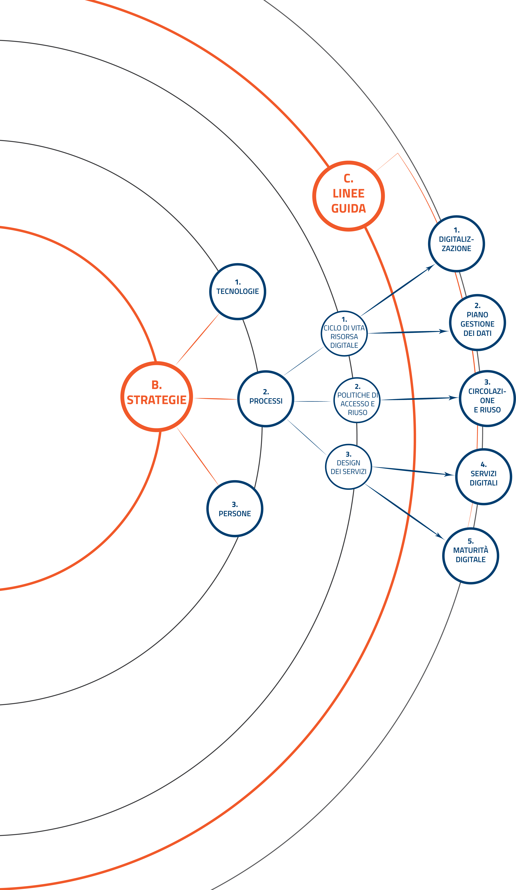

Linee guida per i processi di digitalizzazione
==============================================

Questa sezione del PND intende mettere a disposizione alcuni strumenti
per la pianificazione e l’esecuzione delle attività relative alla
digitalizzazione del patrimonio culturale e dei servizi connessi. La
sezione si articola in una serie di allegati tecnici, ciascuno dei quali
approfondisce uno specifico aspetto delle pratiche di digitalizzazione.
Questi documenti, strutturati in forma di linee guida, saranno
sottoposti a periodiche verifiche per garantirne l’aggiornamento
rispetto all’evoluzione delle normative, dei metodi, degli standard e
dei progressi tecnologici.

Le linee guida definiscono approcci e procedure e forniscono riferimenti
informativi e non prescrittivi, illustrando i principali riferimenti
metodologici e tecnici, con il relativo corredo bibliografico. I
documenti si rivolgono al personale che negli istituti culturali è
coinvolto a vario titolo nei processi di trasformazione digitale, cui
viene fornito un quadro operativo multilivello, che può essere d’ausilio
sia nelle pratiche decisionali e strategiche, sia nella pianificazione e
nell’esecuzione delle operazioni.

Esiste una specifica correlazione fra le azioni strategiche e gli
strumenti a corredo del PND. Gli allegati tecnici offrono modelli e
suggeriscono procedure utili per affrontare le sfide organizzative e
metodologiche poste dall’attuazione dei processi individuati nella
sezione *Strategia*. Nello schema seguente (Figura 5) sono evidenziate
le relazioni fra i processi individuati nel PND e le corrispondenti
Linee guida:

|image0|

*Figura 5. Relazione fra i processi della sezione Strategia e le Linee guida del PND*

A valle di una prima fase di utilizzo sul campo delle Linee guida,
saranno individuati esempi e buone pratiche per ciascun processo
descritto nelle Linee guida, così da facilitarne l’adozione.

.. toctree::
  :maxdepth: 3
  :caption: Indice dei contenuti

  digitalizzazione-del-patrimonio-culturale.rst
  redazione-del-piano-di-gestione-dei-dati.rst
  acquisizione-circolazione-riuso.rst
  classificazione-prodotti-servizi-digitali-processi-e-modelli-di-gestione.rst
  introduzione-alla-metodologia-maturita-digitale.rst
