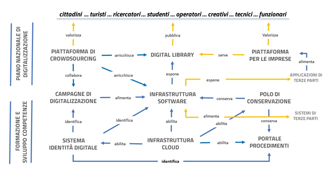

.. _strategie:

Strategia 2022-2026
===================

Per raggiungere gli obiettivi di cambiamento che il Piano
prefigura, è necessario individuare una strategia di attuazione
che sappia cogliere le opportunità offerte dal processo di
trasformazione digitale e tradurle in azioni concrete.

Il PND 2022-2023 delinea le azioni strategiche da realizzare a
livello nazionale, come pre-condizione abilitante per lo sviluppo
di un ecosistema digitale della cultura. Questo ovviamente non
esaurisce né sostituisce le azioni che ciascun comparto
istituzionale o settore disciplinare metterà in campo a partire da
ciò che viene realizzato dal Ministero, d'intesa con le Regioni, a servizio di tutto
l’ecosistema.

Nel contesto storico attuale, tutte le amministrazioni stanno
investendo gran parte delle loro energie nell’attuazione del Piano
Nazionale di Ripresa e Resilienza [23]_, un programma “di portata
e ambizione inedite, che prevede investimenti e riforme per
accelerare la transizione ecologica e digitale; migliorare la
formazione delle lavoratrici e dei lavoratori e conseguire una
maggiore equità di genere, territoriale e generazionale. Per
l’Italia il Next Generation EU rappresenta un’opportunità
imperdibile di sviluppo, investimenti e riforme. L’Italia deve
modernizzare la sua pubblica amministrazione, rafforzare il suo
sistema produttivo e intensificare gli sforzi nel contrasto alla
povertà, all’esclusione sociale e alle disuguaglianze. Il Next
Generation EU può essere l’occasione per riprendere un percorso di
crescita economica sostenibile e duraturo rimuovendo gli ostacoli
che hanno bloccato la crescita italiana negli ultimi decenni”
[24]_.

In coerenza con gli obiettivi del PNRR, nell’ambito della Missione
1 “Digitalizzazione, innovazione, competitività, cultura e
turismo”, Componente 3 “Turismo e Cultura 4.0” il Ministero della
cultura ha previsto uno specifico investimento denominato
“Strategie e piattaforme digitali per il patrimonio culturale”
[25]_ con lo scopo di attuare un progetto organico e strutturato
per:

1. sviluppare il potenziale delle banche dati culturali e delle
   collezioni digitali nella direzione esplicitata nella Visione
   del PND, riconducendo la frammentazione attuale a una
   prospettiva che restituisca l’unitarietà e la complessità del
   patrimonio culturale nazionale;

2. garantire l'uso e l'accessibilità a lungo termine degli archivi
   digitali e dei prodotti di digitalizzazione del patrimonio
   culturale, adottando le nuove strategie di **conservazione**\*
   (approccio **cloud**\*) e capitalizzando i vantaggi che offrono
   in termini di sicurezza e durata nel tempo;

3. semplificare i rapporti con i cittadini e le imprese,
   ridisegnando le procedure di settore e portando i servizi in
   rete;

4. facilitare la crescita di un mercato complementare dei servizi
   culturali aperto alle piccole e medie imprese e alle *start-up*
   innovative, finalizzato a innovare le modalità di fruizione del
   patrimonio culturale;

5. accrescere il capitale umano degli operatori e dei fruitori,
   attraverso azioni formative finalizzate alla crescita delle
   competenze e allo sviluppo consapevole delle potenzialità della
   co-creazione.

L’investimento mira da un lato a recuperare i gap nella
transizione digitale, al pari di ogni altra pubblica
amministrazione, e dall’altro vuole stabilizzare alcuni processi
avviati negli anni passati e accelerati durante la pandemia, per
raggiungere quegli obiettivi di cambiamento descritti in
precedenza (cfr. par. :ref:`visione-obiettivi`). Data l’ampiezza del programma
PNRR e il potenziale trasformativo delle azioni che saranno
introdotte in tale contesto, l’investimento è articolato in
misure progettuali tra loro correlate che, come evidenziato dal grafico della
figura  3, tengono conto di tutte le componenti dell’ecosistema
andando a creare quelle infrastrutture nazionali abilitanti
(hardware, software e di governance) oggi mancanti. Questo anche
nell’ottica di concorrere al conseguimento degli obiettivi di
digitalizzazione previsti dalla “Raccomandazione della Commissione
EU sulla creazione di uno spazio dei dati europeo per il
patrimonio culturale” del novembre 2021 [26]_ nei termini
cronologici indicati e a partecipare, come già ricordato
nell’incipit del Piano, al Cloud collaborativo europeo per il
patrimonio culturale [27]_.

|image0|

Figura 3. *Sistema di relazioni tra gli stream progettuali
dell’investimento M1C3 1.1 “Strategie e piattaforme digitali per
il patrimonio culturale” del PNRR*.

Si tratta di un programma pensato per facilitare e accelerare i
cambiamenti strutturali che l’innovazione tecnologica abilita in
tutto il settore culturale. Esso prevede un’ottica di cooperazione
di lungo periodo, allargata a tutte le componenti dell’ecosistema,
per avviare un percorso di crescita capace di alimentare un
processo di rinnovamento degli istituti culturali, chiamati a
ripensare il proprio ruolo sociale in funzione delle possibilità
offerte dall’ambiente digitale.

L’obiettivo strategico è chiaro: fare in modo che il patrimonio
culturale digitale non si disperda, che possa essere utilizzato
liberamente da tutti e mantenuto nel tempo. Lo Stato s’impegna
dunque, attraverso gli investimenti del PNRR, ad assicurare ad
ogni istituzione culturale che vorrà cooperare la disponibilità e
la preservazione nel lungo periodo dei dati culturali di cui già
dispone e di quelli che vorrà produrre e conferire, attraverso
processi d’identità, di conservazione, di riuso, non alternativi
ma aggiuntivi a quelli esistenti.

In un contesto così eccezionale, è del tutto naturale che il PND
fondi la sua strategia nazionale sulle azioni del PNRR, anche se
ovviamente la sua portata non si esaurisce con esso. Le azioni
strategiche delineate a livello alto nel PND #2022-2023 saranno
progressivamente attuate nel prossimo quinquennio, secondo fasi
che verranno affinate negli aggiornamenti del Piano e che
definiranno per ciascun settore gli obiettivi a breve, medio e
lungo termine, identificando gli indicatori di performance e
impostando le metriche di valutazione dei risultati raggiunti e il
monitoraggio delle azioni programmate.

Come ricordato in vari punti del presente documento, il PND non ha
l’ambizione – ne avrebbe le possibilità – di descrivere i percorsi
di trasformazione digitale o i processi di sviluppo dei singoli
istituti; tuttavia, rappresentando una cornice culturale e di
orientamento strategico, può utilmente indirizzare tale processo
fornendo le componenti comuni sia in termini metodologici che di
componenti abilitanti. In questa prospettiva vanno letti i
capitoli che seguono, che vogliono essere, nella loro stessa
“architettura”, una proposta di metodo.

Le linee di azione strategica sono suddivise e descritte secondo
tre ambiti: le tecnologie abilitanti, i processi e le persone. Le
tecnologie infatti abilitano i processi, che sono governati dalle
persone affinché sulle medesime producano i loro effetti. Su
questi parametri può dunque essere misurata la maturità digitale
di una organizzazione.

Nello schema seguente è riassunta la mappa di navigazione della
sezione (Figura 4).

|image1|

.. |image1| image:: ../media/fig-01.jpg

Figura 4. *Schema dei contenuti della sezione Strategia del PND*

I capitoli “Tecnologie abilitanti” e “Persone” fanno riferimento
per la parte operativa alle piattaforme abilitanti previste nel
PNRR; il capitolo “Processi”, invece, fa riferimento a quanto
approfondito nelle linee guida allegate al Piano.

Per ciascuna linea strategica individuata in questa prima versione
del PND vengono individuate le azioni a breve, medio e lungo
termine che il Ministero metterà in atto a livello nazionale per
facilitare il funzionamento dell’ecosistema digitale nel suo
insieme. Ovviamente queste azioni non rappresentano, né possono
rappresentare, la totalità delle azioni che saranno messe in campo
da tutte le istituzioni ai vari livelli di governo.

.. toctree::
  :maxdepth: 3
  :caption: Indice dei contenuti

  tecnologie_abilitanti.rst
  processi.rst
  persone.rst

.. [23] Per una visione complessiva del PNRR si rimanda al sito informativo della Presidenza del Consiglio dei Ministri https://italiadomani.gov.it/it/home.html

.. [24] Cfr.  https://italiadomani.gov.it/content/dam/sogei-ng/documenti/PNRR%20Aggiornato.pdf

.. [25] Per un approfondimento dell’investimento PNRR 1.1 “Strategie e piattaforma digitali per il patrimonio culturale” si rimanda ai seguenti link: https://pnrr.cultura.gov.it/

.. [26] Raccomandazione (UE) 2021/1970 della Commissione del 10 novembre 2021 relativa a uno spazio comune europeo di dati per il patrimonio culturale (OJ L 401 12.11.2021, p. 5, CELEX: https://eur-lex.europa.eu/legal-content/EN/TXT/?uri=CELEX:32021H1970).

.. [27] Cfr. note 5 e 6 :ref:`contesto` .
