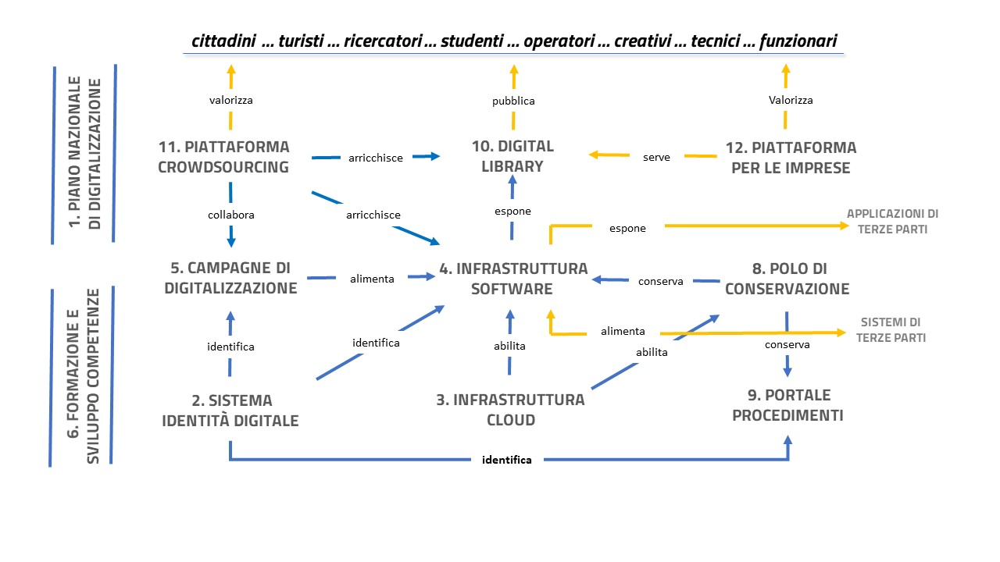

Strategie 2022-2026
===================

Per raggiungere gli obiettivi del PND è necessario individuare una
strategia di attuazione che sappia cogliere le opportunità offerte dal
processo di transizione digitale e tradurle in azioni concrete.

Le azioni strategiche descritte di seguito rappresentano ciò che il
Ministero della cultura intende mettere in campo per innescare,
facilitare e accelerare i cambiamenti strutturali che l’innovazione
tecnologica abilita in tutto il settore culturale. Ciò deve accadere in
un’ottica di cooperazione di lungo periodo, allargata a tutte le
componenti dell’ecosistema, per avviare un percorso di crescita capace
di alimentare un processo di rinnovamento degli istituti culturali,
chiamati a ripensare il proprio ruolo sociale in funzione delle
possibilità offerte dall’ambiente digitale.

Le azioni strategiche delineate nel PND #2022 saranno progressivamente
attuate nel prossimo quinquennio, secondo fasi che verranno affinate
negli aggiornamenti del Piano e che definiranno per ciascun settore gli
obiettivi a breve, medio e lungo termine, identificando gli indicatori
di performance e impostando le metriche di valutazione dei risultati
raggiunti e il monitoraggio delle azioni programmate. Le strategie del
PND concorrono infatti al conseguimento degli obiettivi di
digitalizzazione previsti dalla “Raccomandazione della Commissione EU
sulla creazione di uno spazio dei dati europeo per il patrimonio
culturale” del novembre 2021\ :sup:`6` nei termini cronologici indicati.

In questo contesto, l’investimento M1C3 1.1 “Strategie e piattaforme
digitali per il patrimonio culturale” del Piano Nazionale di Ripresa e
Resilienza (PNRR):sup:`7` è una grande occasione per attuare un progetto
organico e strutturato con l’obiettivo di:

1. sviluppare il potenziale delle banche dati culturali e delle
   collezioni digitali nella direzione esplicitata nella Visione del
   PND, riconducendo la frammentazione attuale a una prospettiva che
   restituisca l’unitarietà e la complessità del patrimonio culturale
   nazionale;

2. garantire l'uso e l'accessibilità a lungo termine degli archivi
   digitali e dei prodotti di digitalizzazione del patrimonio culturale,
   adottando le nuove strategie di conservazione (approccio cloud) e
   capitalizzando i vantaggi che offrono in termini di sicurezza e
   durata nel tempo;

3. semplificare i rapporti con i cittadini e le imprese, ridisegnando le
   procedure di settore e portando i servizi in rete;

4. facilitare la crescita di un mercato complementare dei servizi
   culturali aperto alle piccole e medie imprese e alle *start-up*
   innovative, finalizzato a innovare le modalità di fruizione del
   patrimonio culturale;

5. accrescere il capitale umano degli operatori e dei fruitori,
   attraverso azioni formative finalizzate alla crescita delle
   competenze e allo sviluppo consapevole delle potenzialità della
   co-creazione.

Pertanto, data l’ampiezza del programma PNRR e il potenziale
trasformativo delle azioni che saranno messe in campo in tale contesto,
la strategia digitale del Ministero per il prossimo quinquennio si
identifica con gli obiettivi PNRR e con le azioni che troveranno un
compimento, diretto o indiretto, nei progetti in cui si articola
l’investimento “\ *Strategie e piattaforme digitali per il patrimonio
culturale*\ ”, che sinteticamente può essere riassunto nel seguente
schema logico (Figura 3):

|image0|

Figura 3. Sistema di relazioni tra gli stream progettuali del PNRR. Gli
Stream 1, 6 e 7 sono trasversali ai restanti Stream. Lo Stream 10 rende
fruibili attraverso la Digital Library le collezioni digitalizzate, che
vengono valorizzate attraverso piattaforme specifiche (Stream 11 e 12).

Le linee di azione strategica sono suddivise e descritte secondo tre
ambiti: le tecnologie abilitanti, i processi e le persone. Le tecnologie
infatti abilitano i processi, che sono governati dalle persone affinché
sulle medesime producono i loro effetti. Su questi parametri può dunque
essere misurata la maturità digitale di una organizzazione.

Nello schema seguente è riassunta la mappa di navigazione della sezione
(Figura 4).

|image1|

*Figura 4. Schema dei contenuti della sezione Strategie del PND*

.. toctree::
  :maxdepth: 3
  :caption: Indice dei contenuti

  strategie-2022-2026/tecnologie.rst
  strategie-2022-2026/processi.rst
  strategie-2022-2026/persone.rst

.. |image1| image:: ./media/image5.jpeg
