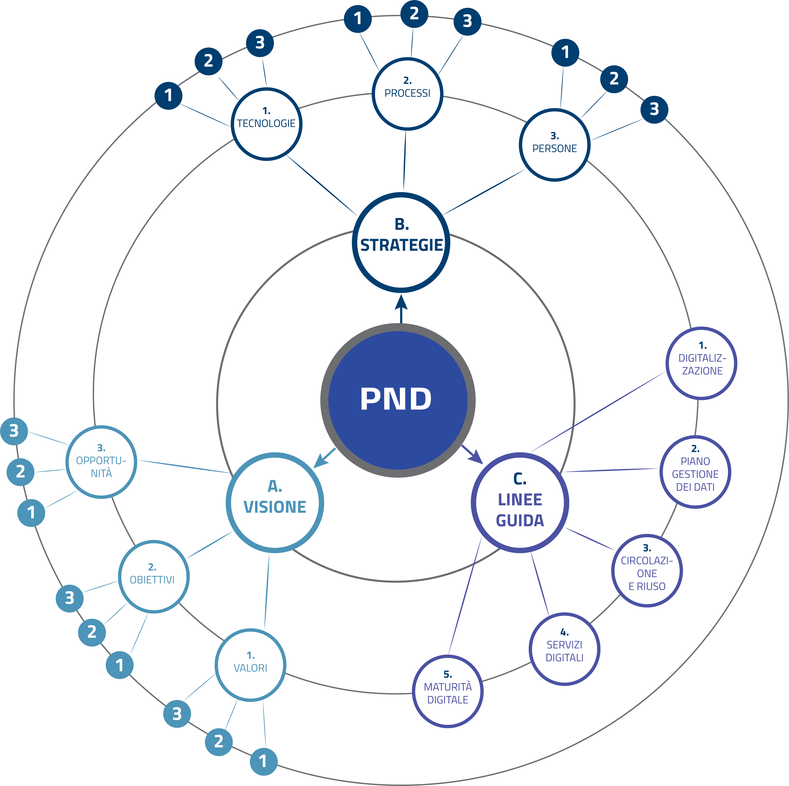

Struttura del documento
=======================

La presente versione del PND #2022-2023 è articolata in tre
sezioni, tra loro collegate in una dimensione di processo (Figura
1):

1. Visione: prefigura le traiettorie e le opportunità di cambiamento, indicando gli obiettivi a lungo termine (cap. :ref:`visione` );

2. Strategia: definisce i fattori necessari per implementare e conseguire gli obiettivi di cambiamento e specifica le azioni che verranno intraprese dal Ministero per assicurare il contesto abilitante comune (cap. :ref:`strategie` );

3. Linee guida: strumenti operativi che supportano la pianificazione e l'esecuzione delle attività legate alla digitalizzazione del patrimonio e alla trasformazione digitale dei luoghi della cultura (cap. :ref:`linee_guida`).

|image0|

*Figura 1. Schema grafico che sintetizza la struttura del PND*

Nel testo che segue, le parole evidenziate con asterisco e
**grassetto\*** trovano un approfondimento nel capitolo “Parole
chiave” posto in coda al documento (le parole sono evidenziate
solo nella loro prima occorrenza). In tale sezione i termini
selezionati vengono analizzati al fine di fornire elementi
ulteriori e più specifici per comprendere il contesto culturale e
tecnico da cui originano. Non si tratta quindi di un
“vocabolario” esaustivo o un elenco di definizioni, ma di un
approfondimento dei concetti chiave citati in forma discorsiva
nel corpo del documento.

La bibliografia e i riferimenti normativi debbono intendersi come
essenziali e non esaustivi. Tutti i link citati sono stati
consultati alla data del 28/06/2022.

I termini inglesi che non sono ancora entrati nel vocabolario
corrente italiano sono scritti in corsivo e sono accompagnati
dalla traduzione italiana; la scelta di mantenere tali termini in
inglese deriva dalla necessità di assicurare una corrispondenza
con la letteratura tecnica di riferimento.

Alcune ridondanze nell’esposizione dei concetti fondativi sono
state conservate presupponendo anche una modalità di lettura del
Piano per parti. 

Poiché il PND non ha scopo divulgativo o didattico, ma
costituisce un orientamento metodologico ed operativo per chi
lavora a vario titolo nelle istituzioni culturali, il linguaggio
utilizzato presuppone una discreta conoscenza della terminologia
tecnica e delle metodologie di base utilizzate nelle tecnologie
dell’informazione e della comunicazione. Tuttavia l’insieme di
testo, linee guida, approfondimenti, note, bibliografia e
riferimenti normativi si ritiene possa consentire la comprensione
complessiva dei contenuti ed essere di ausilio per incrementare
alcune conoscenze. Saranno comunque divulgate sintesi e tutorial
per una miglior metabolizzazione dei contenuti.

