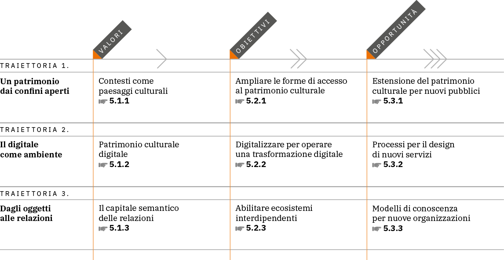

.. _visione:

Visione
=======

Il patrimonio culturale italiano si è strutturato nel tempo a
partire dalla tutela e dalla conservazione dei beni culturali
materiali; l’inclusione dei beni immateriali è avvenuta
gradualmente, nell’ultimo mezzo secolo. Ora siamo di fronte a una
nuova stagione di ampliamento e di trasformazione della sfera
patrimoniale, in virtù della rapida affermazione, nella realtà
sociale e culturale in cui viviamo, di un **ecosistema
digitale**\* fondato sulle relazioni. Occorre quindi condurre
un’attenta analisi della domanda e delle aspettative generate
dall’opportunità che il digitale offre nel creare nuovi
**servizi**\*  [11]_,assistere e favorire la nascita di imprese
innovative e intercettare bisogni emergenti, sia dal punto di
vista dei visitatori/utenti (i.e. ridisegnando le modalità di
interazione interne ed esterne) che dal punto di vista dei luoghi
della cultura (i.e.  ottimizzando le logiche di lavoro). Si
tratta di un mutamento profondo, che mette al centro il concetto
di **cultura digitale\***, intesa come potente sistema di
relazioni capace di attivare nuove prospettive di senso e
coinvolgere ampie fasce di pubblico che in passato, per ragioni
diverse, sono rimaste escluse dalla fruizione culturale. In tale
scenario gli attori non sono più solo gli istituti culturali sin
qui operanti in autonomia, ma le persone: quelle che custodiscono
il patrimonio (i rappresentanti di istituzioni, enti, luoghi
della cultura), che lo studiano e lo mantengono vivo con la
ricerca, che lo valorizzano, reinterpretano e ripensano secondo
nuovi linguaggi, ovvero tutti gli operatori della cultura, le
imprese e i professionisti presenti nelle aree di dominio
dell’ecosistema. In base a tale lettura, il patrimonio culturale,
con il suo portato di storia e memoria, può essere dunque inteso
come una risorsa utile per interpretare il mondo che ci circonda.
Per descrivere tale processo, sono state individuate tre
traiettorie di cambiamento - interpretative delle dinamiche in
atto - che pongono in un rapporto di reciproca interdipendenza i valori, gli
obiettivi e le opportunità della **trasformazione digitale**\*.

I contenuti della sezione sono organizzati su una struttura
concettuale a matrice, che come tale può essere letta
orizzontalmente, per enfatizzare la dimensione processuale (le
traiettorie), oppure verticalmente, per identificare i diversi
piani di lettura (i capitoli in cui si articola il testo) (Figura
2).

|image0|

Figura 2. *Contenuti della sezione visione del pnd: in evidenza le relazioni fra i paragrafi*.

.. toctree::
  :maxdepth: 3
  :caption: Indice dei contenuti

  valori.rst
  obiettivi.rst
  opportunita.rst

.. [11] La parola «servizio» verrà utilizzata in contesti molto diversi dei vari componenti che andranno a costituire il Piano nazionale di digitalizzazione (cfr. sezione :ref:`Parole chiave<parole_chiave>`). In questo caso, con l’espressione “nuovi servizi” si fa riferimento alle diverse tipologie di attività o prestazioni erogabili in formato digitale da parte dei luoghi della cultura, nell’ambito dello sviluppo della strategia di digitalizzazione del patrimonio culturale elaborata nel presente documento.
