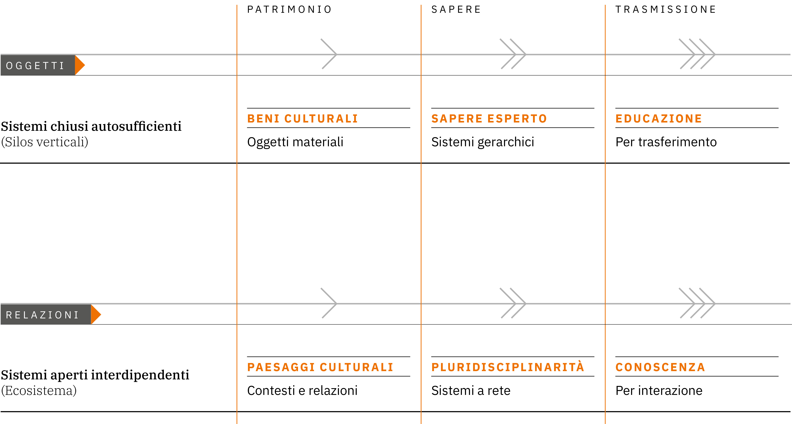
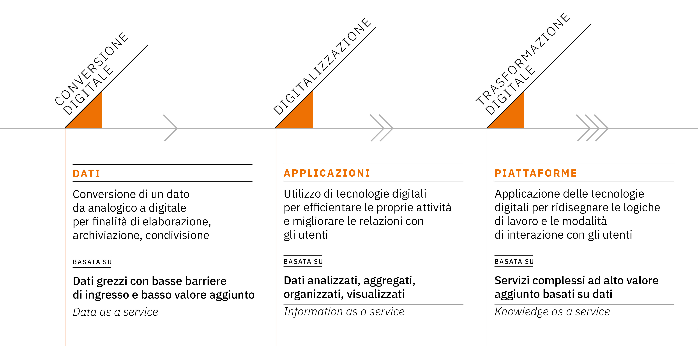
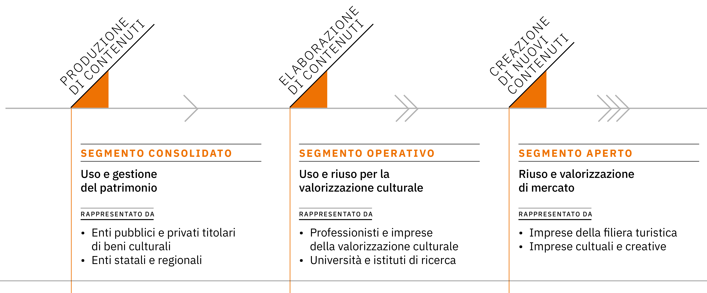

Opportunità
===========

I valori alla base della trasformazione digitale del patrimonio
culturale si concretizzano in obiettivi e azioni che offrono
opportunità di cambiamento. Il consolidamento dell’ecosistema
digitale consente infatti ai diversi pubblici di partecipare al
processo creativo del patrimonio digitale, grazie al valore delle
relazioni generate dalle interdipendenze. Tale modalità operativa
permette la progettazione di servizi basati sulle esigenze degli
utenti, abilitati a partecipare al processo di sviluppo in
qualità di co-creatori di contenuti, servizi e valori secondo i
principi dello *universal design* (progettazione universale). In
tale scenario è naturale ipotizzare l’evoluzione dell’attuale
paradigma organizzativo verso nuovi modelli gestionali.

Inoltre, l’adozione di sistemi di conoscenza basati su dati
digitali condivisi, interoperabili, collegati a sistemi
gestionali flessibili, è oggi indispensabile per il monitoraggio
dei dati, la conservazione programmata, le attività di controllo
periodico delle collezioni e delle condizioni degli ambienti in
cui sono collocate; così come, su un altro versante, l’analisi
dei dati è essenziale per una più efficace attività di
valorizzazione, consentendo di accompagnare le esposizioni o le
iniziative temporanee con una preparazione degli eventi sui
social media (pre-visita), proponendo contenuti arricchiti e
mettendo poi in campo sistemi raffinati di valutazione d’impatto
(post-visita). Senza contare, infine, le opportunità di
crowdfunding culturale, semplificate e rese più agevoli dalla
strutturazione di canali digitali permanenti di dialogo con i
propri pubblici.

.. _estensione_del_patrimonio_culturale_per_nuovi_pubblici:

Estensione del patrimonio culturale per nuovi pubblici
------------------------------------------------------

Il patrimonio culturale digitale è una risorsa che incorpora
storia e memoria (cfr. par. :ref:`patrimonio_culturale_digitale`), e che per questo è
in grado di originare informazioni sulle interazioni che gli
utenti sviluppano con esso. Se adeguatamente promosso all’interno
di piattaforme digitali progettate sulle necessità dei fruitori,
può testimoniare e storicizzare l’evoluzione della società
nell’era digitale, ridefinendo il valore culturale nello spazio
virtuale. La rete permette fruizioni plurime, gratuite e
simultanee delle risorse digitali ed è una sorgente inesauribile
di storie che possono essere lette, interpretate e rielaborate da
coloro che vi accedono, anche al di fuori dei confini e dei
saperi disciplinari. Un patrimonio aperto e l’ampliamento delle
forme di accesso alla cultura rafforzeranno il concetto di “nuovi
pubblici”: ciò che ci si attende quindi oggi dalle applicazioni
digitali di accesso al patrimonio culturale è l’opportunità per
qualsiasi utente di partecipare, sperimentare, interagire,
diffondere e riutilizzare il patrimonio culturale pubblico; in
questa direzione è pensata anche la *piattaforma* di accesso
prevista nell’ambito dell’investimento del PNRR (cfr. par. :ref:`disseminazione_culturale_condivisione_sociale` ), che metterà a disposizione contenuti culturali resi
accessibili ad un bacino di utenti molto ampio, siano essi
consumatori finali, imprese interessate alla creazione di
prodotti o servizi oppure qualsiasi altro utilizzatore della
piattaforma. Il fenomeno dell’auto-pubblicazione, ad esempio,
favorisce la produzione di *user-generated stories* (storie
generate da utenti), in cui gli utenti figurano come autorio
co-curatori dell’opera. Man mano che la storia prende forma, è
possibile chiedere al lettore/osservatore un giudizio attivo,
così da modificarne la traiettoria in corso d’opera in un
processo di co-creazione che rende concreta la prospettiva della
trasformazione digitale.

Le nuove logiche di produzione contenutistica investono anche le
attività di **crowdsourcing**\*, quali forme di collaborazione
generativa di comunità d’interesse (cfr. par. :ref:`co_creazione_crowdsorcing`). Esse si
caratterizzano non solo per la partecipazione proattiva del
pubblico, ma anche perché esplicitano il processo attraverso cui
si realizzano. Le piattaforme aggregano, raccontano e
razionalizzano in categorie definite le informazioni, stimolando
la comunità a compiere azioni simili; esse hanno un ruolo
determinante nella diffusione e visibilità dei contenuti, poiché
permettono di collegare utenti animati da diversi interessi.

Si concretizza dunque l’opportunità di sperimentare nuovi
processi basati su un certo livello di disintermediazione nelle
catene di produzione e distribuzione dei contenuti, consentendo
così agli utenti di produrre, modificare e proporre non solo
nuove classificazioni dei contenuti, ma anche rinnovate forme di
documentazione della cultura materiale e immateriale attraverso
linguaggi nuovi o interventi creativi. In questo modo è possibile andare incontro al segmento meno noto (segmento “aperto”) dei fruitori del patrimonio culturale digitale (cfr. par. :ref:`capitale_semantico_delle_relazioni` ),
consolidando nuovi pubblici e con essi il potere di generare
visioni ulteriori del patrimonio culturale.

|image0|

Figura 3. *Traiettoria 1 – dagli oggetti alle relazioni: il passaggio concettuale da sistemi chiusi autosufficienti a sistemi aperti interdipendenti*

Processi per il design di nuovi servizi
---------------------------------------

La gestione di una crescente quantità di dati riguardanti i beni
culturali rappresenta una sfida per gli operatori del patrimonio.
L’obiettivo perseguito sino ad oggi è stato rendere visibile e
accessibile l’imponente masse di informazioni prodotte negli anni
dalle istituzioni culturali relativamente ai patrimoni
conservati; un approccio basato evidentemente sui dati intesi
come prodotto offerto (**data as a service**\*). La
trasformazione digitale dei luoghi della cultura offre
l’opportunità di invertire la prospettiva basata sulla quantità
delle risorse pubblicate online, per concentrarsi invece sulla
qualità degli oggetti culturali digitali e sulle possibili
modalità di accesso e di fruizione. La rapida evoluzione del web
- che ha ridefinito i modelli dell’interazione sociale - e il contesto democratico e inclusivo di internet, hanno determinato
nuovi bisogni degli utenti, ancora non del tutto indagati in modo
sistematico, ma percepiti come riflessi di altri ambiti.
All’interno dell’ecosistema digitale, è fondamentale progettare
servizi capaci di offrire agli individui processi di conoscenza
intesi come un’autentica esperienza di crescita culturale
(**knowledge as a service**\*).

Un design esperienziale, dunque, deve soddisfare il desiderio
degli utenti di sentirsi protagonisti attivi e non spettatori
passivi, secondo criteri di inclusività, efficacia (raggiungendo
con velocità, accuratezza e completezza ciò che stanno cercando)
ed efficienza (con il minor dispendio di risorse possibili).

Progettare servizi basati su questi criteri significa sviluppare
processi generativi capaci non solo di accogliere e indicizzare i
contenuti, ma di valorizzarne le relazioni, che rappresentano la
vera ricchezza del patrimonio informativo del sistema dei beni
culturali.  Tali servizi dovranno essere progettati per un’utenza ampliata, rispettando i criteri di accessibilità [20]_ e usabilità
[21]_, utilizzando una pluralità di modalità comunicative che
facciano ricorso alla multi-sensorialità, all’interattività, ad
ausili e/o supporti tecnologici assistivi o con configurazioni
particolari.

In un’ottica di *universal design* (progettazione universale),
*co-design* (co-progettazione) e partecipazione attiva, gli
utenti dovranno avere la possibilità di personalizzare e
condividere le proprie esperienze di fruizione secondo un
approccio inclusivo.

In questo contesto, l’erogazione di servizi progettati secondo le
evidenze delle tecniche di studio dei percorsi che l’utente fa
nell’esperire un servizio (**user journey**\*) e fruibili
indifferentemente su diversi dispositivi rispettando i criteri di
accessibilità, offre ai singoli istituti potenzialità infinite
per rinnovare le modalità di relazione con i propri pubblici.

L’interazione di questi parametri permetterà di individuare,
costruire, monitorare e migliorare i servizi sviluppati e le
tipologie di utenza, con l’obiettivo di offrire un’esperienza
fluida e soddisfacente; un approccio, dunque, non solo
tecnologico, ma ispirato alla qualità dei servizi, verificata
sull’intero percorso di fruizione dell’utente - prima, durante e
dopo l’esperienza d’uso -, sulla base di *processi* pensati
*end-to-end* (dal gestore al fruitore e viceversa). Per un
approfondimento della relazione tra servizi, processi e modelli
di gestione si rimanda alle indicazioni contenute nelle *Linee
guida per la classificazione di prodotti e servizi digitali,
processi e modelli di gestione* (cfr. par. :ref:`linee_guida_classificazione`) nella
sezione :ref:`linee_guida` del presente documento.

L’opportunità offerta da questo approccio consiste nel
coinvolgimento nella catena di produzione del valore di soggetti
esterni agli istituti culturali: le imprese culturali e creative
e quelle della filiera turistica, gli enti del terzo settore, gli
istituti di ricerca potranno operare in sinergia con le
istituzioni culturali al fine di aumentare la quantità e la
qualità dei servizi messi a disposizione della collettività.
Affinché tale processo sia duraturo e sostenibile, è necessario
che le risorse digitali siano prodotte in una filiera certificata
e mantenute nel tempo, rimanendo stabilmente accessibili nel
lungo periodo (cfr. par. :ref:`digitalizzazione_ciclo_vita_risorsa_digitale`). In particolare, come evidenziato
nelle stesse *linee guida* sopracitate, le risorse digitali
potranno essere impiegate da utenti e imprese per la creazione e
la produzione, sia offline che online, di prodotti e servizi a
valore aggiunto di forme molto diverse (testi, video, visite
virtuali, documentari, film, installazioni, mostre multimediali,
audioguide, quiz, *trivial*, workshop, corsi di formazione
online, soluzioni di *gamification*, edizioni digitali in serie
limitata, app, podcast, audiolibri, chatbot, modelli
tridimensionali, ecc.).

|image1|

Figura 4. *Traiettoria 2 – dall’informatizzazione alla trasformazione digitale: i vari aspetti della digitalizzazione*.

Modelli di conoscenza per nuove organizzazioni
----------------------------------------------

La traiettoria che muove dagli oggetti alle relazioni ha
l’obiettivo di abilitare un ecosistema interdipendente capace di
valorizzare il capitale semantico, la vera ricchezza del
patrimonio informativo pubblico. Questo cambiamento offre la
possibilità di creare nuovi modelli di conoscenza, collocati nel
cuore dell’organizzazione degli istituti della cultura. Portare
il patrimonio culturale al centro delle politiche per i
cittadini, ponendo al cuore dell’ecosistema digitale non più le
risorse, ma gli utenti e le relazioni che essi instaurano con gli oggetti digitali, è un processo che riscrive la catena del valore culturale e ridefinisce i modelli organizzativi delle
istituzioni, affermando il primato della conoscenza e della
rilevanza sociale della diffusione dei saperi.

Non si tratta di una questione esclusivamente tecnologica: le
entità dell’ecosistema del patrimonio culturale che popolano
l’ambiente digitale sono molteplici, e solo in parte delimitate e delimitabili nell’acronimo MAB (Musei, Archivi, Biblioteche) o
GLAM (*Galleries, Libraries, Archives, Museum*). All’interno di
questo universo possiamo infatti individuare in modo schematico:

-  un segmento “consolidato”, rappresentato dagli istituti che
   detengono il patrimonio culturale e producono dati e
   informazioni su di esso;

-  un segmento “operativo”, costituito dagli studiosi e dai
   diversi operatori che a vario titolo agiscono attorno al
   patrimonio culturale;

-  un segmento “aperto”, cioè un universo dinamico e mutevole di
   utenti generalisti, studenti, associazioni, turisti e imprese
   culturali e creative operanti nella filiera produttiva.

Per creare catene di valore in un ecosistema così strutturato,
occorre trovare linguaggi, forme comunicative e soluzioni
tecnologiche capaci di rappresentare la stratificazione semantica degli oggetti digitali, limitando il potere dispersivo della rete. Il principale rischio connesso alla veicolazione di informazioni complesse e di dati collegati reciprocamente, è quello di disorientare gli utenti e disperdere i nessi logici fra le risorse nell’oceano informativo del web. Arginare tale pericolo è il compito di un sistema organizzativo costruito attorno a nuove figure professionali che possiedano le competenze necessarie per guidare le traiettorie di cambiamento dell’innovazione digitale.

Il presidio delle fasi dei progetti di digitalizzazione palesa la necessità di definire una struttura organizzativa interna
composta di diverse unità operative [22]_, che possono anche non
essere permanentemente internalizzate o compresenti, ma che
devono comunque essere attivate all’avvio dei progetti di
innovazione. Di fronte a un quadro tecnologico in costante e
rapido mutamento, i nuovi modelli organizzativi devono
necessariamente rispondere dinamicamente alle sollecitazioni
dell’ambiente; ciò rappresenta la più grande sfida, ma anche una
straordinaria opportunità per gli istituti culturali.

|image2|

Figura 5. *Traiettoria 3 – dalla produzione di dati alla creazione di contenuti: le componenti dell’ecosistema digitale culturale*

.. [20] Si rimanda alla parola «accessibilità» definita all‘interno del paragrafo "Parole chiave” posta in coda al documento, dove è presente anche la relativa rispondenza normativa.

.. [21] Per la progettazione di servizi web si rimanda alle *Linee Guida di design per i servizi web delle PA* redatte dall’Agenzia per l’Italia digitale: https://docs.italia.it/italia/designers-italia/design-linee-guida-docs/it/stabile/index.html.

.. [22] In riferimento agli enti coinvolti e al team di progetto connessi alle attività di digitalizzazione, si veda l’Allegato tecnico “Linee guida per la Digitalizzazione del patrimonio culturale”, sezione C e l’allegato tecnico “Linee guida per la redazione del Piano di gestione dei dati”, sezione *Data Governance* interna.
